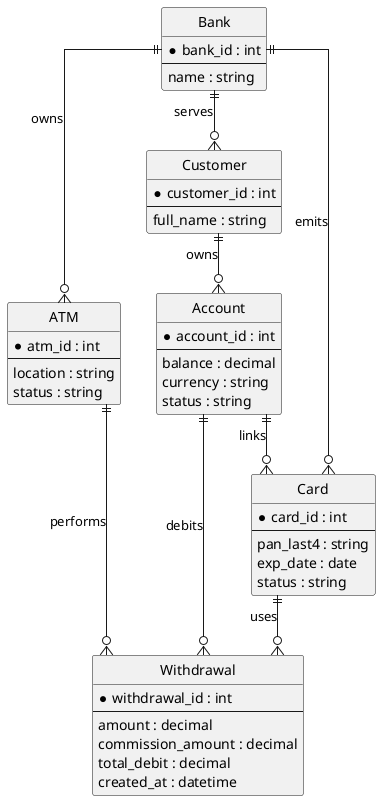
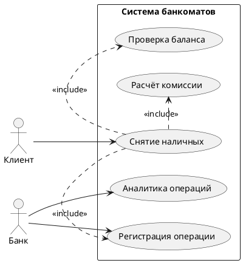
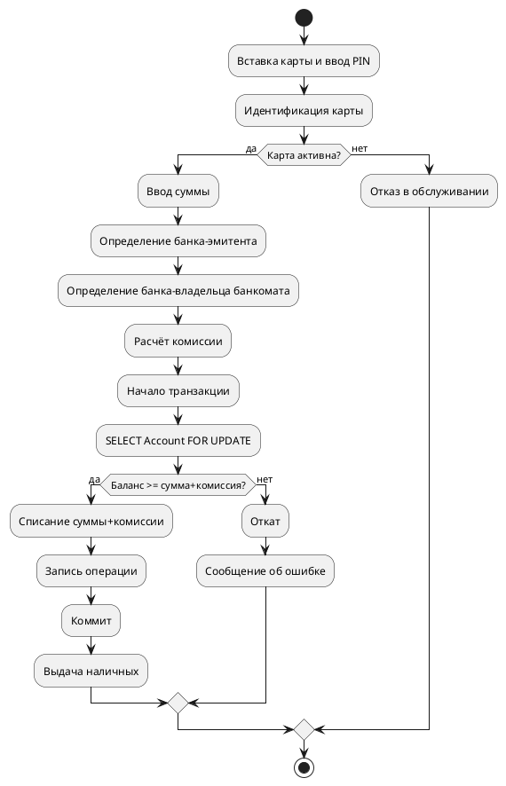
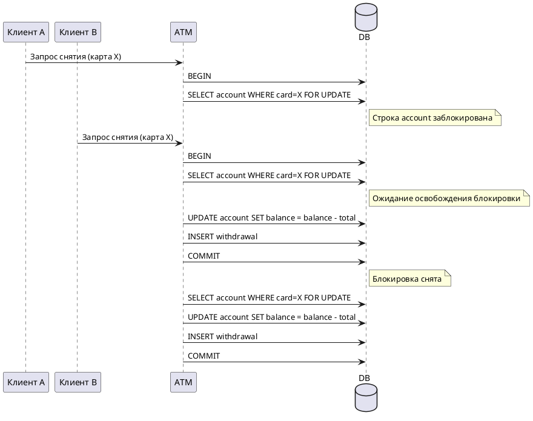

# Курсовая “Банкоматы” (тема №36) — проектирование

## 1) Диаграммы PlantUML

### 1.1 ER-диаграмма (концептуальная модель)


### 1.2 Функциональная модель (use-case)


### 1.3 Activity-диаграмма алгоритма “Снятие наличных”


### 1.4 Диаграмма конкурентного доступа (последовательностей)


## 2) Логическая и физическая модель БД

### 2.1 Логическая модель (таблицы и связи)
- **banks** (банки)
- **atms** (банкоматы) — принадлежит банку
- **customers** (клиенты) — обслуживаются банком
- **accounts** (счета) — принадлежат клиентам
- **cards** (карты) — эмитируются банком и привязаны к счёту
- **withdrawals** (операции снятия) — ссылаются на банкомат, карту и счёт

Связи:
- banks 1..N atms
- banks 1..N customers
- banks 1..N cards
- customers 1..N accounts
- accounts 1..N cards
- cards 1..N withdrawals
- atms 1..N withdrawals
- accounts 1..N withdrawals

### 2.2 Физическая модель (типы данных, PK/FK, индексы)

**banks**
- bank_id INT PK AI
- name VARCHAR(120) UNIQUE

**atms**
- atm_id INT PK AI
- bank_id INT FK → banks(bank_id)
- location VARCHAR(255)
- status ENUM('active','inactive')
- INDEX idx_atms_bank_id

**customers**
- customer_id INT PK AI
- bank_id INT FK → banks(bank_id)
- full_name VARCHAR(200)
- INDEX idx_customers_bank_id

**accounts**
- account_id INT PK AI
- customer_id INT FK → customers(customer_id)
- balance DECIMAL(14,2)
- currency CHAR(3)
- status ENUM('active','blocked')
- INDEX idx_accounts_customer_id

**cards**
- card_id INT PK AI
- account_id INT FK → accounts(account_id)
- issuing_bank_id INT FK → banks(bank_id)
- pan_last4 CHAR(4)
- exp_date DATE
- status ENUM('active','blocked')
- UNIQUE (account_id, pan_last4)
- INDEX idx_cards_issuing_bank_id

**withdrawals**
- withdrawal_id BIGINT PK AI
- atm_id INT FK → atms(atm_id)
- card_id INT FK → cards(card_id)
- account_id INT FK → accounts(account_id)
- amount DECIMAL(14,2)
- commission_amount DECIMAL(14,2)
- total_debit DECIMAL(14,2)
- created_at DATETIME
- INDEX idx_withdrawals_atm_id
- INDEX idx_withdrawals_card_id
- INDEX idx_withdrawals_created_at

## 3) SQL-файл (schema + inserts + trigger/procedure)
Полный файл: `schema.sql`.

## 4) Бизнес-правило комиссии
- Если банк-эмитент карты совпадает с банком-владельцем банкомата → комиссия **0%**.
- Если банки разные → комиссия **1.2%** от суммы выдачи.

Используется при расчёте `commission_amount` и `total_debit = amount + commission_amount`.

## 5) Сценарий конкурентного доступа (SQL/псевдокод)
```sql
START TRANSACTION;

-- Блокируем строку счёта, связанную с картой
SELECT a.account_id, a.balance
FROM accounts a
JOIN cards c ON c.account_id = a.account_id
WHERE c.card_id = :card_id
FOR UPDATE;

-- Рассчитываем комиссию
-- commission = CASE WHEN issuing_bank_id = atm_bank_id THEN 0 ELSE amount * 0.012 END

-- Проверяем баланс
-- IF balance >= amount + commission THEN
UPDATE accounts
SET balance = balance - (:amount + :commission)
WHERE account_id = :account_id;

INSERT INTO withdrawals (
  atm_id, card_id, account_id, amount, commission_amount, total_debit, created_at
) VALUES (
  :atm_id, :card_id, :account_id, :amount, :commission, :amount + :commission, NOW()
);

COMMIT;

-- При недостаточном балансе: ROLLBACK;
```
